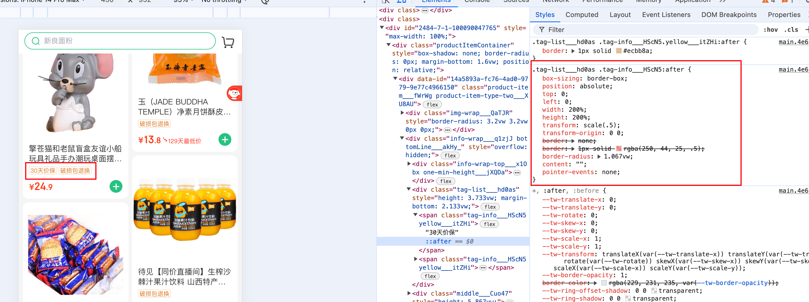

# 1. 实现 0.5px border

:::

- 1. 实现 0.5px border 的方式常用的解决方案为京东的 实现方式，通过伪元素实现边框，先将元素放大一倍 然后在使用 `translate:scale(0.5)` 缩小一半
     

```css
.tag-info___HScN5 {
  box-sizing: border-box;
  box-sizing: border-box;
  display: inline-flex;
  position: relative;
  height: 3.467vw;
}
.tag-info___HScN5::after {
  box-sizing: border-box;
  position: absolute;
  top: 0;
  left: 0;
  width: 200%;
  height: 200%;
  transform: scale(0.5);
  transform-origin: 0 0;
  border: 1px solid rgba(250, 44, 25, 0.5);
  border-radius: 1.067vw;
  content: "";
  pointer-events: none;
}
```

```html
<span class="tag-info___HScN5">30天价保</span>
```

:::
