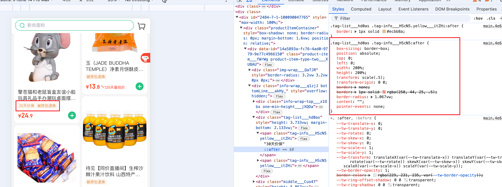

# 1. 实现 0.5px border

:::

- 1. 实现 0.5px border 的方式常用的解决方案为京东的实现方式，通过伪元素实现边框，先将元素放大一倍 然后在使用 `translate:scale(0.5)` 缩小一半
     

```css
.tag-info___HScN5 {
  box-sizing: border-box;
  box-sizing: border-box;
  display: inline-flex;
  position: relative;
  height: 3.467vw;
}
.tag-info___HScN5::after {
  box-sizing: border-box;
  position: absolute;
  top: 0;
  left: 0;
  width: 200%;
  height: 200%;
  transform: scale(0.5);
  transform-origin: 0 0;
  border: 1px solid rgba(250, 44, 25, 0.5);
  border-radius: 1.067vw;
  content: "";
  pointer-events: none;
}
```

```html
<span class="tag-info___HScN5">30天价保</span>
```

:::

# 2. 实现 flex 布局中的 flex-direction: column-reverse 的方式有哪些

:::

- 1. 使用 grid 布局

```css
.container {
  display: grid;
  grid-template-rows: repeat(2, 1fr);
  grid-auto-flow: column;
}
.item {
  width: 100%;
  line-height: 100px;
  text-align: center;
}
.item-1 {
  grid-row: 2;
  background-color: #f00;
}
.item-2 {
  grid-row: 1;
  background-color: #0f0;
}
```

```html
<div class="container">
  <div class="item item-1">1</div>
  <div class="item item-2">2</div>
</div>
```


:::


# 3. 谈谈你对css BFC 的理解
:::
  - 定义: `BFC`是 block formatting context 即块级格式化上下文。就是css 世界的结界，结界就是通过一些手段形成的封闭的空间，里面的出不去，外面的人进不来。
  - 具体表现: 内部的元素再怎么翻江倒海都不会影响到外部的元素，所以BFC元素不可能发生margin重叠问题
  - BFC 触发方式： 
     - float 的值不为none
     - overflow的值为: scoll, hidden, auto
     - display的值为 block, table, table-cell
     - position的值不为relative, static
    
:::