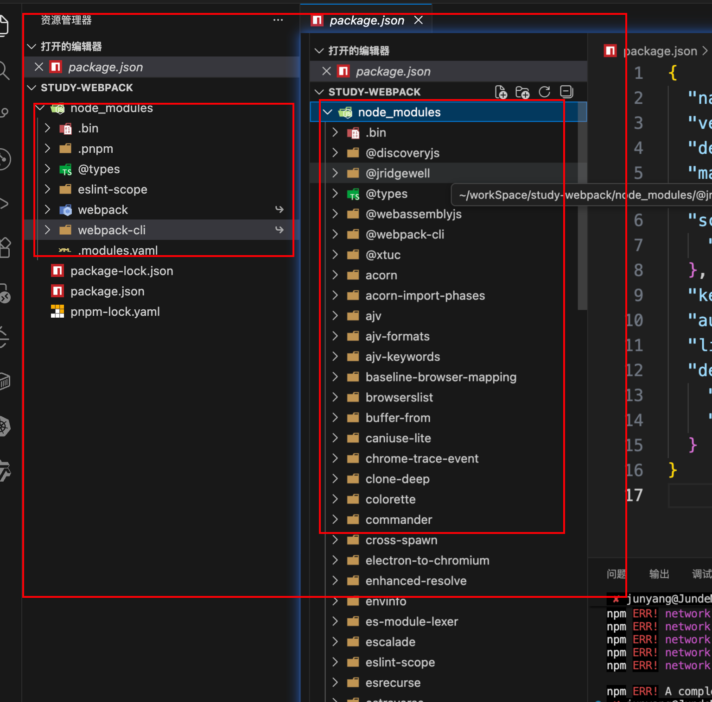

## 前端打包 / 构建工具对比总览

| 工具    | 类型           | 主要场景                  | 特点概览                                      |
| ------- | -------------- | ------------------------- | --------------------------------------------- |
| webpack | 打包器 Bundle  | 传统 SPA / 中大型前端项目 | 功能最全、生态成熟、配置灵活但偏复杂          |
| Vite    | 构建工具 + Dev | Vue3 / React 新项目       | 开发体验极佳，原生 ESM，打包底层用 Rollup     |
| Rollup  | 打包器 Bundle  | 类库 / SDK 打包           | 输出体积极小，Tree Shaking 强，适合库开发     |
| Parcel  | 零配置打包器   | 小中型应用、快速原型      | 上手简单，自动推断配置，生态相对没 webpack 强 |

## webpack vs Vite

- **共同点**
  - 都支持 Vue / React 等主流框架
  - 都能做代码分割、按需加载、静态资源处理等
- **不同点（核心体验）**
  - webpack：基于打包的开发服务器，首次启动和热更新依赖打包结果
  - Vite：开发时直接基于浏览器原生 ESM，按需编译，启动极快
- **什么时候更适合 webpack**
  - 老项目迁移成本大，已有大量 webpack 配置 / Loader / Plugin
  - 需要特别复杂、定制化的构建流程
- **什么时候更适合 Vite**
  - 新项目，尤其是 Vue3 / React18
  - 更重视开发体验和构建速度

## webpack vs Rollup

- **共同点**
  - 都是模块打包器，都支持 Tree Shaking
- **不同点（主要定位）**
  - webpack：更偏「应用打包」，内建很多面向应用的能力（代码分割、动态 import、dev server 等）
  - Rollup：更偏「库打包」，默认输出更干净、体积更小
- **适用场景**
  - 写业务应用 → 更推荐 webpack / Vite
  - 写一个 npm 库 / UI 组件库 / SDK → 更推荐 Rollup（或用 Vite 的 lib 模式，底层也是 Rollup）

## webpack vs Parcel

- **共同点**
  - 都是前端打包器，支持多种资源类型
- **不同点（使用门槛）**
  - webpack：需要显式写配置文件，学习成本高，但可配置能力最强
  - Parcel：强调「零配置」，自动推断很多设置，适合快速起盘
- **适合用 Parcel 的情况**
  - 想非常快速地起一个 demo / 小项目
  - 不想一开始就纠结构建细节

## 包管理工具对比：npm / Yarn / pnpm / Bun

| 工具 | 安装方式          | 主要特点                                                                                 | 适用场景                           |
| ---- | ----------------- | ---------------------------------------------------------------------------------------- | ---------------------------------- |
| npm  | Node 自带         | 生态最早、文档多，早期有性能和锁问题, 安装的包是平铺在 node_modules 引用时会出现幽灵依赖 | 老项目、默认环境                   |
| Yarn | `npm i -g yarn`   | 解决 npm 早期问题，锁文件更稳定，workspaces 支持                                         | Monorepo、对一致性要求较高         |
| pnpm | `npm i -g pnpm`   | 硬链接 + 去重存储，安装极快，磁盘占用小                                                  | 中大型项目、Monorepo、日常开发首选 |
| Bun  | `curl` / 官网安装 | 集「运行时 + 打包 + 测试」于一体，速度非常快                                             | 新项目尝鲜、高性能工具链           |

### 选择建议

- 个人项目 / 新项目：**pnpm**（性能好、省空间，支持 monorepo，VuePress 官方示例也多用 pnpm）
- 需要与团队 / 老项目保持一致：沿用 **npm / Yarn** 即可
- 想尝鲜一体化高性能工具链：可以关注 **Bun**，但生态成熟度略逊于前面几种

## 小结：如何选型

- 已有大型项目 / 需要深度定制构建流程：**webpack**
- 新项目、追求开发体验、Vue3/React：**Vite（底层亦可理解为：开发 Vite + 打包 Rollup）**
- 做公共库 / SDK：**Rollup（或 Vite lib 模式）**
- 小项目 / 快速原型：**Parcel**
